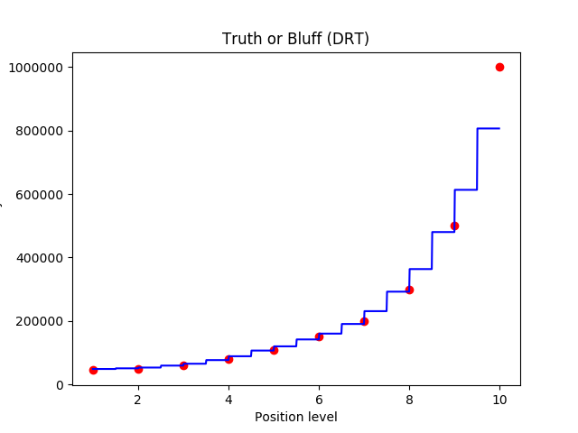

# Bluff-Detector

### A simple Node web app that uses Random Forest Regression to detect if an employee is demanding excessive salary or is the salary demanded is justified.

## This app inputs:

```
1.Employee position (rank in company ) in the form of a number. Ex: CEO is assigned a rank 10 .
Larger the rank , larger the salary.
Position-Salaries.csv in sample data folder provides example data.
2. Employees demanded salary.
3. A .csv file containing details of previous records of positions and salaries of company's employees.

```

## Functionalities


This app takes the above inputs and predicts whether the employee is honest or is the employee bluffing.
The node app.js file then sends the information to a python script that implements Random Forest Regression , an ensemble Machine Learning Algorithm on the data to predict the possible salary of the employee.


## PREREQUISITES

```
Node Js
NPM
Python

```

## To run

```
Clone this repo
Change the path to Python as per your machine in the options variable in app.js
Cd into this repo
Npm install
Node app.js
```
Open Your favourite browser and go to localhost:3000 to access this site.

The output display a plot showing the Random Forest Regression curve for your data.
